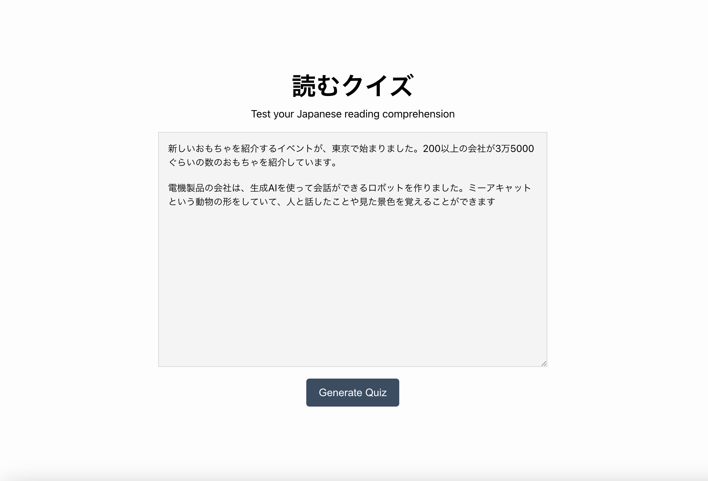
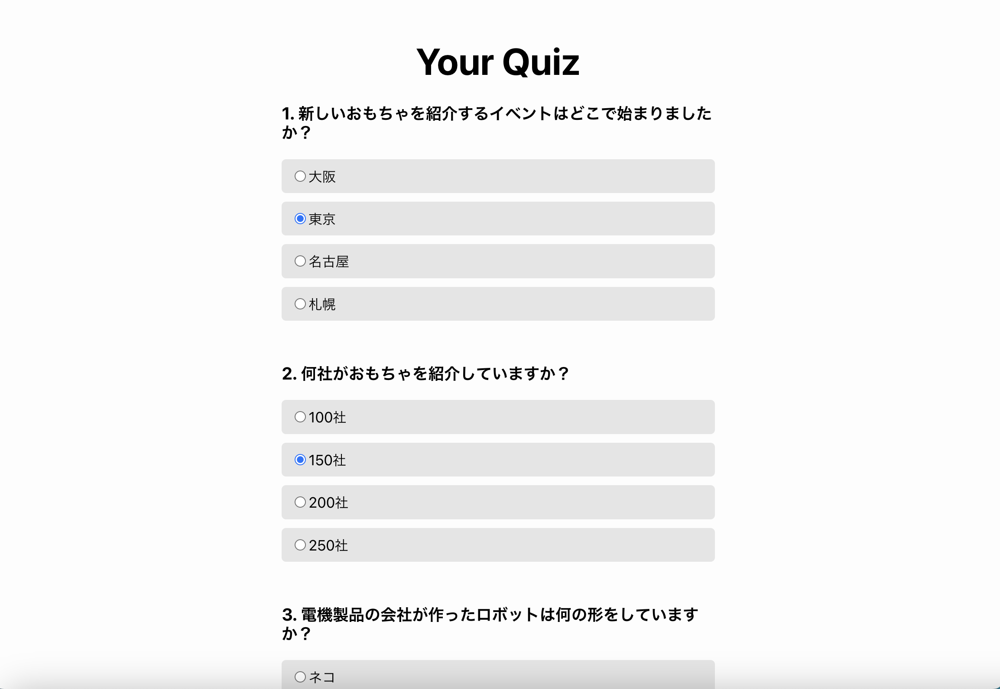
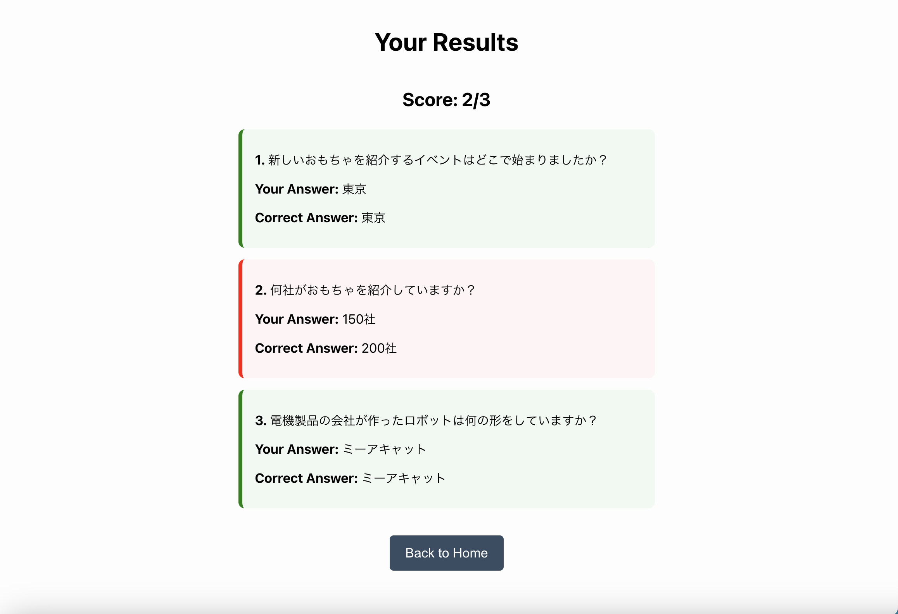

# 読むクイズ - Japanese Reading Quiz Generator

A web app that generates Japanese reading comprehension quizzes using FastAPI (backend) and React (frontend). Powered by OpenAI.

## 🚀 Features
- Input any Japanese text
- Auto-generate multiple-choice quiz questions
- Submit answers and receive instant scoring
- Clean UI with React
- AI-powered quiz generation via OpenAI API

## 🛠 Tech Stack
- **Frontend**: React, React Router
- **Backend**: FastAPI, OpenAI API
- **Language**: Python, JavaScript

## 📦 Installation

### Clone the Repository
```bash
git clone https://github.com/kaitlync31/japanese-quiz-app.git
cd language-app
```

### Backend Setup 
```bash
cd backend
python3 -m venv venv
source venv/bin/activate
pip install -r requirements.txt
# Create a .env file in backend/
echo "OPENAI_API_KEY=your_api_key_here" > .env
uvicorn main:app --reload
```

### Frontend Setup 
```bash
cd frontend
npm install
npm start
```

## 📸 Screenshots
### Home Page

### Quiz Page

### Score Page


## 🎯 Future Improvements
- Add support for difficulty levels (easy, medium, hard)
- Save user progress / scores
- Deploy online (Vercel + Render/Heroku)
